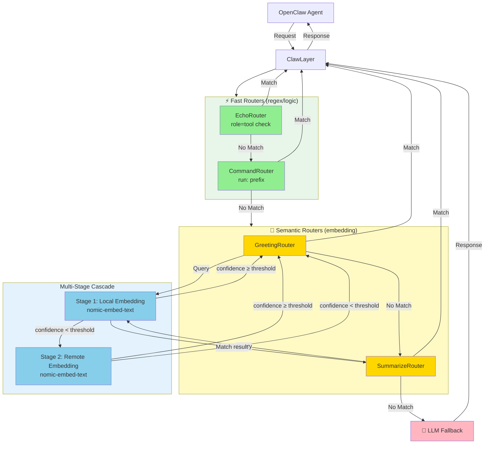
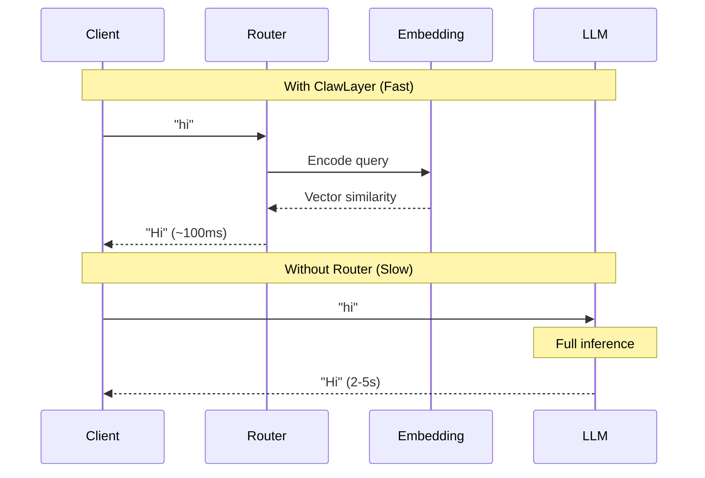
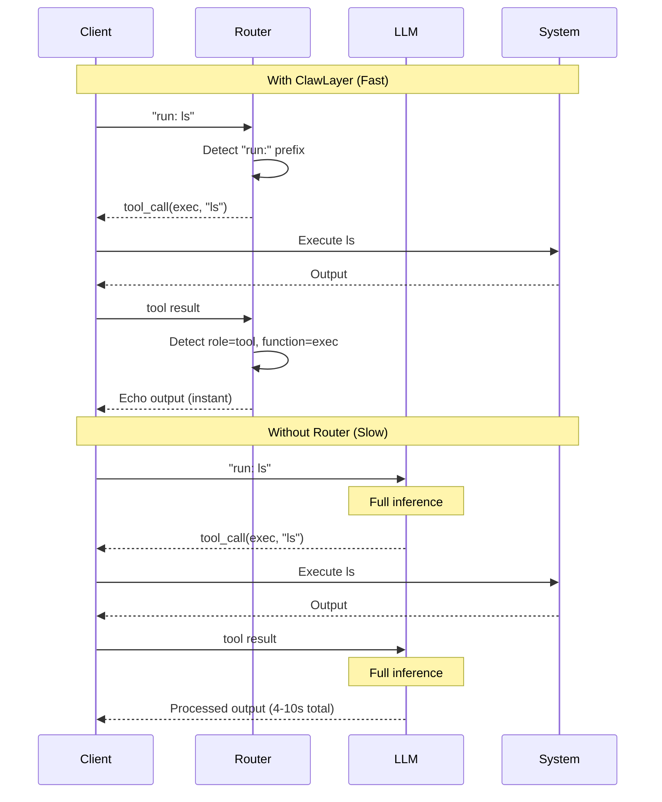

# ClawLayer

The intelligent layer for **OpenClaw** AI agents - optimizing performance through smart routing, caching, and cost management.

## Purpose

ClawLayer sits between OpenClaw agents and LLMs, providing an intelligent routing layer that intercepts common patterns before they reach expensive inference:

- **Instant responses** for greetings and routine queries
- **Zero-latency tool calls** for command execution patterns
- **Echo optimization** for tool results that don't need LLM processing
- **Transparent fallback** to full LLM inference when needed

By routing predictable interactions through static responses and intelligent caching, ClawLayer delivers instant responses for common operations while maintaining full LLM capabilities for complex reasoning tasks.

### System Architecture



**Legend**: 🟢 Fast (regex/logic) | 🟡 Medium (semantic) | 🔵 Embedding model | 🔴 Slow (LLM inference)

**Flow**: Fast Routers → Semantic Routers (with cascade) → LLM Fallback. Semantic routers use embedding models only, never LLMs.

## Features

- **Multi-Stage Cascade Routing**: Cost-optimized semantic matching with confidence-based fallback
- **Semantic Routing**: Embedding-based matching for greetings and summaries
- **Regex Routing**: Fast pattern matching for commands (run:)
- **Echo Optimization**: Bypasses LLM for tool execution results
- **Static Responses**: Instant responses without LLM inference
- **LLM Fallback**: Forwards unmatched requests to Ollama
- **Streaming Support**: Full SSE streaming for both static and proxied responses

## Router Priority

Routers are organized into two categories, each with its own priority:

### Fast Routers (checked first)
1. **EchoRouter** - Detects tool execution results (role=tool, function=exec) - 🟢 Instant
2. **CommandRouter** - Detects "run:" prefix for command execution - 🟢 Instant (regex)

### Semantic Routers (checked after fast routers)
3. **GreetingRouter** - Semantic similarity matching for greetings - 🟡 ~100ms (embedding)
4. **SummarizeRouter** - Semantic similarity for summary requests - 🟡 ~100ms (embedding)

### Fallback
5. **LLM Proxy** - Forwards to LLM for everything else - 🔴 2-5s (full inference)

## Speed Optimization

### Greeting Route (Semantic Matching)



### Command Execution (Regex Matching)



## Setup

```bash
# Install dependencies
pip install flask requests python-dotenv pyyaml semantic-router

# Copy example config
cp config.example.yml config.yml
# Edit config.yml with your settings
```

## Configuration

ClawLayer supports **multiple LLM providers** for flexible deployment.

### config.yml

```yaml
# Define multiple providers
providers:
  # Local Ollama for embeddings
  local:
    url: http://localhost:11434
    type: ollama
    models:
      embed: nomic-embed-text
  
  # Remote Ollama for text generation
  remote:
    url: http://192.168.1.100:11434/v1/chat/completions
    type: openai
    models:
      text: llama3.2
      vision: llava:latest
  
  # OpenAI for production
  openai:
    url: https://api.openai.com/v1/chat/completions
    type: openai
    models:
      text: gpt-4
      embed: text-embedding-3-small

# Assign providers to tasks
defaults:
  embedding_provider: local   # Fast local embeddings
  text_provider: remote       # Remote text generation
  vision_provider: openai     # OpenAI for vision

# Router configuration
routers:
  # Priority order (first match wins, then returns immediately)
  priority: [echo, command, greeting, summarize]
  
  # EchoRouter - Fast logic check
  echo:
    enabled: true
  
  # CommandRouter - Fast regex check  
  command:
    enabled: true
    prefix: "run:"
  
  # GreetingRouter - Uses semantic matching internally
  greeting:
    enabled: true
    use_semantic: true
    provider: local  # Override to use specific provider
  
  # SummarizeRouter - Uses semantic matching internally
  summarize:
    enabled: true
    use_semantic: true
    provider: local
```

### Environment Variables

```bash
export EMBEDDING_PROVIDER=local
export TEXT_PROVIDER=remote
export VISION_PROVIDER=openai
export CLAWLAYER_CONFIG=/path/to/config.yml
```

## Usage

```bash
# Run ClawLayer
python run.py -v

# Run with full request logging
python run.py -vv

# Run with streaming chunk logging
python run.py -vvvv

# Run tests
python -m unittest tests.test_clawlayer -v
```

## API

OpenAI-compatible endpoints:
- `GET /v1/models`
- `POST /v1/chat/completions`

Supports both streaming and non-streaming modes.

## Extending ClawLayer

### Multi-Provider Use Cases

**Hybrid deployment - local embeddings, remote inference:**
```yaml
providers:
  local:
    url: http://localhost:11434
    models:
      embed: nomic-embed-text
  
  remote:
    url: http://gpu-server:11434/v1/chat/completions
    models:
      text: llama3.2-70b

defaults:
  embedding_provider: local   # Fast local embeddings
  text_provider: remote       # Powerful remote model
```

**Multi-cloud setup:**
```yaml
providers:
  ollama:
    url: http://localhost:11434
    models:
      embed: nomic-embed-text
      text: llama3.2
  
  openai:
    url: https://api.openai.com/v1/chat/completions
    models:
      text: gpt-4
      vision: gpt-4-vision-preview

defaults:
  embedding_provider: ollama  # Local embeddings
  text_provider: openai       # OpenAI for complex queries
  vision_provider: openai     # OpenAI for vision
```

### Customize Router Behavior

Edit `config.yml` to enable/disable routers or change priority within each category:

```yaml
routers:
  # Fast routers - checked first
  fast:
    priority:
      - command  # Check commands before echo
      - echo
    
    command:
      enabled: true
      prefix: "exec:"  # Change prefix
  
  # Semantic routers - checked after fast routers
  semantic:
    priority:
      - summarize  # Check summaries before greetings
      - greeting
    
    greeting:
      enabled: false  # Disable greeting router
```

### Multi-Stage Cascade Configuration

Semantic routers support **multi-stage cascading** to optimize cost and accuracy. Each stage tries a different embedding provider with its own confidence threshold:

```yaml
semantic:
  greeting:
    enabled: true
    stages:
      - provider: local           # Stage 1: Fast local embedding
        model: nomic-embed-text
        threshold: 0.75          # Require 75% similarity
      - provider: remote          # Stage 2: Fallback if confidence < 0.75
        model: nomic-embed-text
        threshold: 0.6           # Accept 60% similarity
    utterances:
      - "hello"
      - "hi"
      - "hey"
```

**How it works:**

1. **Stage 1** (local): Query is embedded and compared to utterances using cosine similarity
   - If similarity ≥ 0.75 → Match! Return response immediately
   - If similarity < 0.75 → Continue to Stage 2

2. **Stage 2** (remote): Query is embedded again with different provider
   - If similarity ≥ 0.6 → Match! Return response
   - If similarity < 0.6 → No match, cascade to LLM

**Example scenarios:**

```
"hello" → Stage 1: similarity 0.92 ≥ 0.75 ✓ → Return (1 embedding call)
"hey what's up" → Stage 1: 0.68 < 0.75 → Stage 2: 0.71 ≥ 0.6 ✓ → Return (2 embedding calls)
"weather today" → Stage 1: 0.3 < 0.75 → Stage 2: 0.4 < 0.6 → LLM fallback (2 embeddings + 1 LLM)
```

**Benefits:**
- **Cost optimization**: 80% of queries match at Stage 1 (cheap local embeddings)
- **Accuracy**: 15% cascade to Stage 2 (better model for edge cases)
- **Flexibility**: Only 5% reach expensive LLM inference

**Confidence scores** are cosine similarity values (0.0 to 1.0) calculated by the `semantic-router` library:
- 1.0 = identical vectors
- 0.8-1.0 = very similar
- 0.6-0.8 = somewhat similar  
- <0.6 = not similar

See [docs/CASCADE.md](docs/CASCADE.md) for advanced patterns.

### Add Custom Router

Add a new router by implementing the Router interface:

```python
from clawlayer.router import Router, RouteResult

class CustomRouter(Router):
    def route(self, message: str, context: dict) -> Optional[RouteResult]:
        if "custom_pattern" in message:
            return RouteResult(name="custom", content="Custom response")
        return None
```

Then add it to the router chain in `app.py`:

```python
routers = [
    EchoRouter(),
    CommandRouter(),
    CustomRouter(),  # Add your router
    GreetingRouter(),
    SummarizeRouter()
]
```

### File Structure

```
clawlayer/
├── __init__.py          # Package exports
├── app.py               # Flask application & dependency injection
├── config.py            # Configuration management
├── handler.py           # Message handling & response generation
├── proxy.py             # LLM proxy for forwarding requests
└── routers/
    ├── __init__.py      # Base classes (Router, RouteResult) + exports
    ├── echo_router.py   # EchoRouter - tool result detection
    ├── command_router.py # CommandRouter - command prefix detection
    ├── greeting_router.py # GreetingRouter - semantic greeting matching
    ├── summarize_router.py # SummarizeRouter - semantic summary matching
    └── router_chain.py  # RouterChain - router management

tests/
└── test_clawlayer.py    # Comprehensive unit tests

config.yml               # Main configuration
config.example.yml       # Example configuration
run.py                   # Entry point
```

## Testing

All core components have comprehensive unit tests:

```bash
# Run all tests
python -m unittest tests.test_clawlayer -v

# Run specific test class
python -m unittest tests.test_clawlayer.TestCommandRouter -v

# Run specific test
python -m unittest tests.test_clawlayer.TestCommandRouter.test_detects_run_prefix -v
```

## Related Projects

- **[ClawRouter](https://github.com/BlockRunAI/ClawRouter)** - Advanced routing with load balancing, fallback chains, and cost optimization for production deployments
