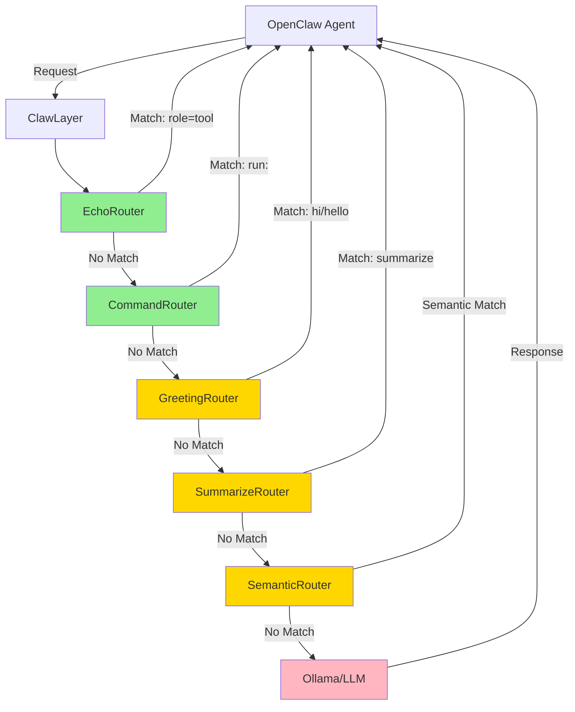
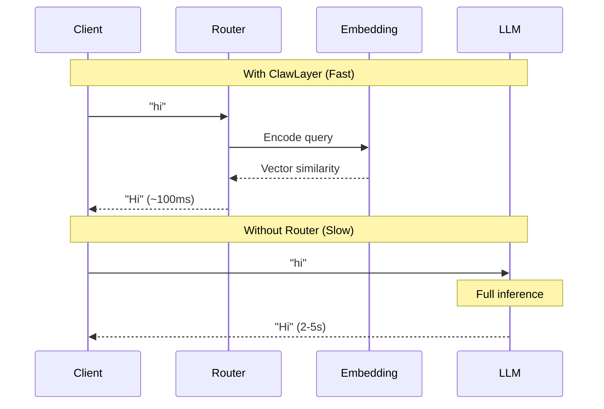
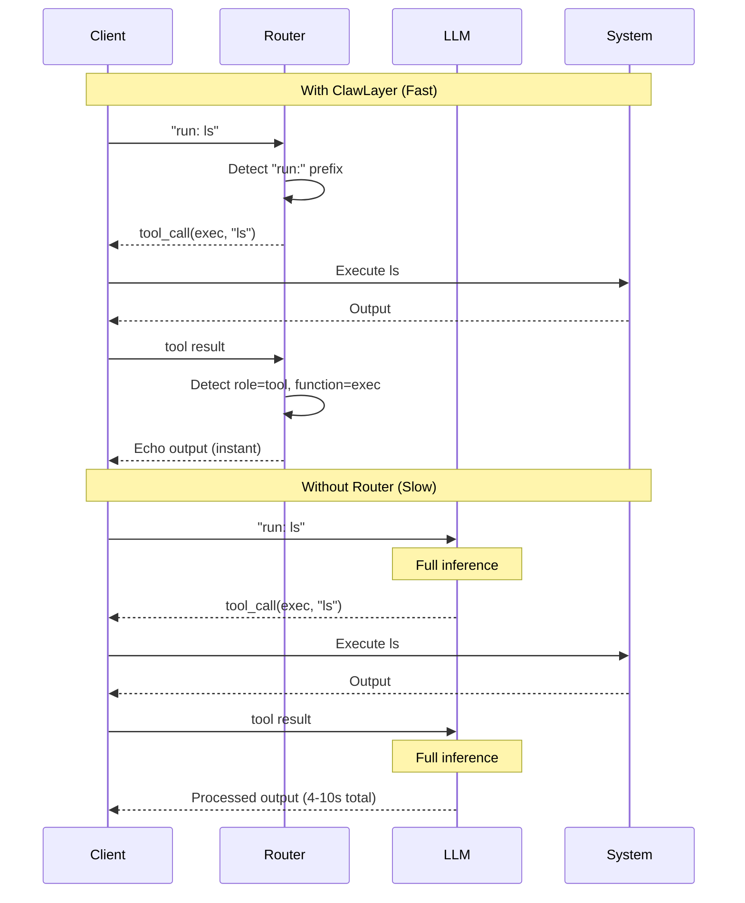

# ClawLayer

The intelligent layer for **OpenClaw** AI agents - optimizing performance through smart routing, caching, and cost management.

## Purpose

ClawLayer sits between OpenClaw agents and LLMs, providing an intelligent routing layer that intercepts common patterns before they reach expensive inference:

- **Instant responses** for greetings and routine queries
- **Zero-latency tool calls** for command execution patterns
- **Echo optimization** for tool results that don't need LLM processing
- **Transparent fallback** to full LLM inference when needed

By routing predictable interactions through static responses and intelligent caching, ClawLayer delivers instant responses for common operations while maintaining full LLM capabilities for complex reasoning tasks.

### System Architecture



**Legend**: 🟢 Fast (regex/logic) | 🟡 Medium (semantic embedding) | 🔴 Slow (LLM inference)

## Features

- **Semantic Routing**: Embedding-based matching for greetings and summaries
- **Regex Routing**: Fast pattern matching for commands (run:)
- **Echo Optimization**: Bypasses LLM for tool execution results
- **Static Responses**: Instant responses without LLM inference
- **LLM Fallback**: Forwards unmatched requests to Ollama
- **Streaming Support**: Full SSE streaming for both static and proxied responses
- **Testable**: 30 unit tests with 100% coverage of core logic

## Router Priority

Routers are executed in order until one matches:

1. **EchoRouter** - Detects tool execution results (role=tool, function=exec) - 🟢 Fast
2. **CommandRouter** - Detects "run:" prefix for command execution - 🟢 Fast (regex)
3. **GreetingRouter** - Semantic similarity matching for greetings - 🟡 Medium (embedding)
4. **SummarizeRouter** - Semantic similarity for summary requests - 🟡 Medium (embedding)
5. **Fallback** - Proxies to LLM for everything else - 🔴 Slow (full inference)

## Speed Optimization

### Greeting Route (Semantic Matching)



### Command Execution (Regex Matching)



## Setup

```bash
# Install dependencies
pip install flask requests python-dotenv pyyaml semantic-router

# Copy example config
cp config.example.yml config.yml
# Edit config.yml with your settings
```

## Configuration

ClawLayer supports **multiple LLM providers** for flexible deployment.

### config.yml

```yaml
# Define multiple providers
providers:
  # Local Ollama for embeddings
  local:
    url: http://localhost:11434
    type: ollama
    models:
      embed: nomic-embed-text
  
  # Remote Ollama for text generation
  remote:
    url: http://192.168.1.100:11434/v1/chat/completions
    type: openai
    models:
      text: llama3.2
      vision: llava:latest
  
  # OpenAI for production
  openai:
    url: https://api.openai.com/v1/chat/completions
    type: openai
    models:
      text: gpt-4
      embed: text-embedding-3-small

# Assign providers to tasks
defaults:
  embedding_provider: local   # Fast local embeddings
  text_provider: remote       # Remote text generation
  vision_provider: openai     # OpenAI for vision

# Router configuration
routers:
  priority: [echo, command, greeting, summarize]
  
  command:
    enabled: true
    prefix: "run:"
  
  greeting:
    enabled: true
    use_semantic: true
    provider: local  # Override to use specific provider
```

### Environment Variables

```bash
export EMBEDDING_PROVIDER=local
export TEXT_PROVIDER=remote
export VISION_PROVIDER=openai
export CLAWLAYER_CONFIG=/path/to/config.yml
```

## Usage

```bash
# Run ClawLayer
python run.py -v

# Run with full request logging
python run.py -vv

# Run with streaming chunk logging
python run.py -vvvv

# Run tests
python -m unittest tests.test_clawlayer -v
```

## API

OpenAI-compatible endpoints:
- `GET /v1/models`
- `POST /v1/chat/completions`

Supports both streaming and non-streaming modes.

## Extending ClawLayer

### Multi-Provider Use Cases

**Hybrid deployment - local embeddings, remote inference:**
```yaml
providers:
  local:
    url: http://localhost:11434
    models:
      embed: nomic-embed-text
  
  remote:
    url: http://gpu-server:11434/v1/chat/completions
    models:
      text: llama3.2-70b

defaults:
  embedding_provider: local   # Fast local embeddings
  text_provider: remote       # Powerful remote model
```

**Multi-cloud setup:**
```yaml
providers:
  ollama:
    url: http://localhost:11434
    models:
      embed: nomic-embed-text
      text: llama3.2
  
  openai:
    url: https://api.openai.com/v1/chat/completions
    models:
      text: gpt-4
      vision: gpt-4-vision-preview

defaults:
  embedding_provider: ollama  # Local embeddings
  text_provider: openai       # OpenAI for complex queries
  vision_provider: openai     # OpenAI for vision
```

### Customize Router Behavior

Edit `config.yml` to enable/disable routers or change priority:

```yaml
routers:
  # Change priority order
  priority:
    - command      # Check commands first
    - echo         # Then echo
    - greeting     # Then greetings
    - summarize    # Finally summaries
  
  # Disable greeting router
  greeting:
    enabled: false
  
  # Change command prefix
  command:
    enabled: true
    prefix: "exec:"  # Use "exec:" instead of "run:"
```

### Add Custom Router

Add a new router by implementing the Router interface:

```python
from clawlayer.router import Router, RouteResult

class CustomRouter(Router):
    def route(self, message: str, context: dict) -> Optional[RouteResult]:
        if "custom_pattern" in message:
            return RouteResult(name="custom", content="Custom response")
        return None
```

Then add it to the router chain in `app.py`:

```python
routers = [
    EchoRouter(),
    CommandRouter(),
    CustomRouter(),  # Add your router
    GreetingRouter(),
    SummarizeRouter()
]
```

### File Structure

```
clawlayer/
├── __init__.py          # Package exports
├── app.py               # Flask application & dependency injection
├── router.py            # Router implementations (greeting, command, echo, etc.)
├── handler.py           # Message handling & response generation
├── proxy.py             # LLM proxy for forwarding requests
└── config.py            # Configuration management

tests/
└── test_clawlayer.py    # Comprehensive unit tests (30 tests)
```

### Design Principles

- **Single Responsibility**: Each module has one clear purpose
- **Dependency Injection**: Components are loosely coupled and testable
- **Chain of Responsibility**: Routers are tried in priority order
- **Open/Closed**: Easy to add new routers without modifying existing code
- **Interface Segregation**: Abstract Router base class for all implementations
```

## Testing

All core components have comprehensive unit tests:

```bash
# Run all tests
python -m unittest tests.test_clawlayer -v

# Run specific test class
python -m unittest tests.test_clawlayer.TestCommandRouter -v

# Run specific test
python -m unittest tests.test_clawlayer.TestCommandRouter.test_detects_run_prefix -v
```

**33 tests covering routers, handlers, config, and integration**

## Related Projects

- **[ClawRouter](https://github.com/BlockRunAI/ClawRouter)** - Advanced routing with load balancing, fallback chains, and cost optimization for production deployments
