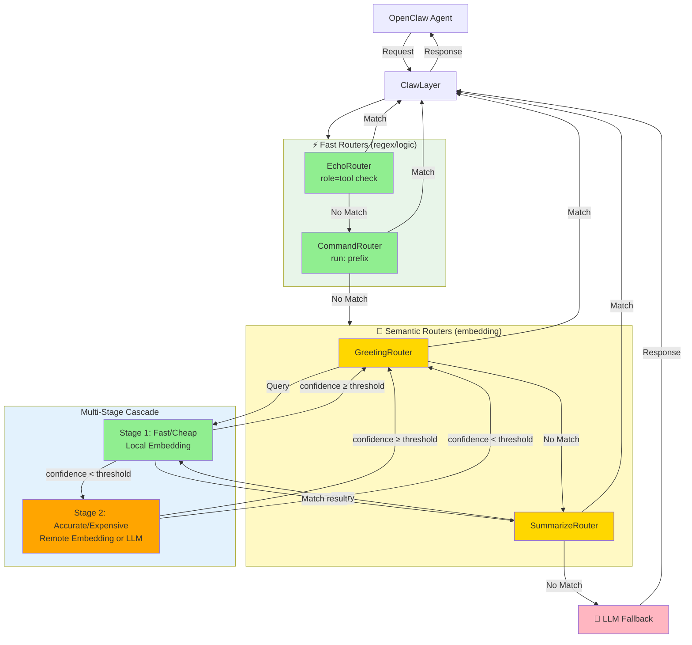
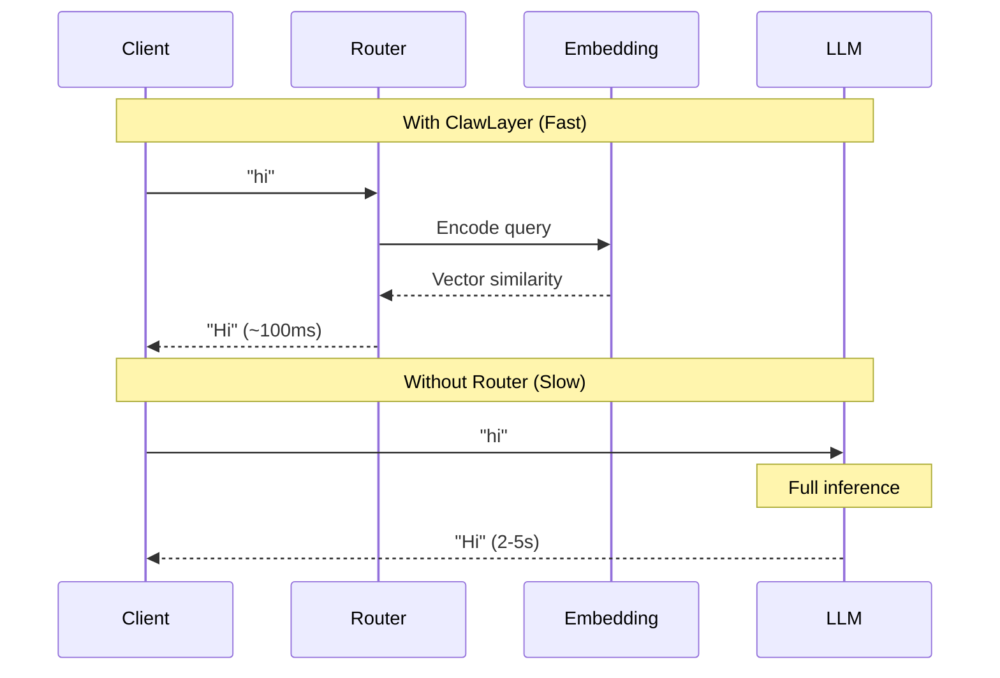
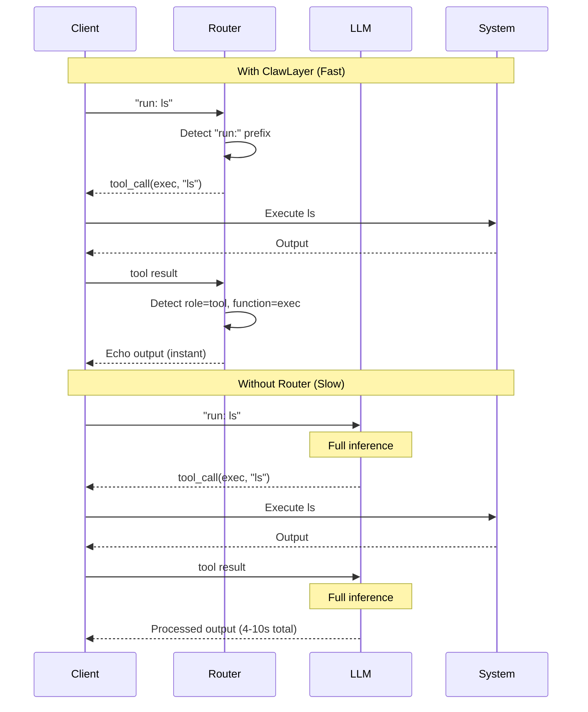
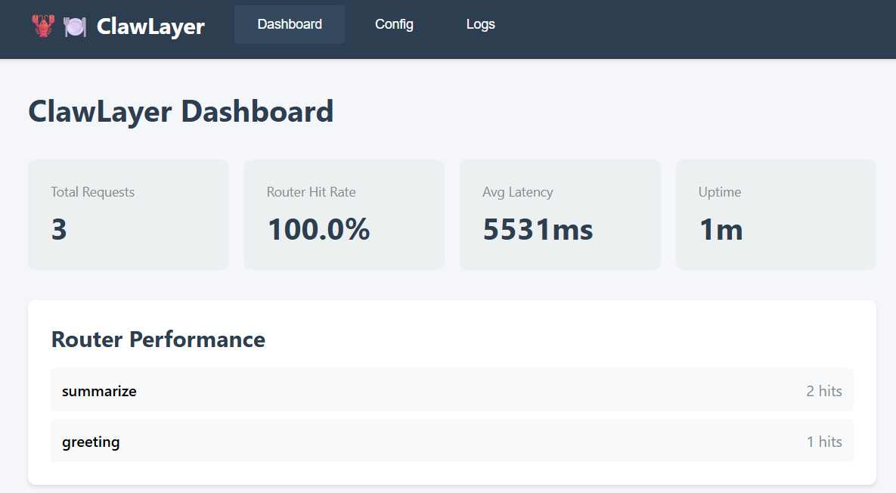

# ClawLayer

A **lightweight, intelligent proxy and routing layer** for **OpenClaw** AI agents - delivering instant responses, cost savings, and deep observability into agent-LLM communication for security, development, and troubleshooting.

## Purpose

ClawLayer provides a **simple YAML-driven configuration** to route OpenClaw agent requests intelligently:

- **Instant responses** for greetings and routine queries via semantic matching
- **Zero-latency tool calls** for command execution patterns via quick router (regex)
- **Multi-stage cascade** from fast/cheap to accurate/expensive models
- **Transparent fallback** to full LLM inference when needed
- **Real-time monitoring** with web UI to inspect prompts, context, and responses

**Key Benefits:**
- ⚡ **Quick Response**: Zero-latency routing for commands, ~100ms for semantic matching vs 2-5s LLM inference
- 💰 **Cost Savings**: Route 80% of requests through cheap models, 15% through mid-tier, 5% to expensive LLM
- 🔍 **Deep Observability**: Inspect full agent-LLM communication (prompts, context, responses) via web UI
- 🛡️ **Security Guardrails**: Monitor and analyze all requests/responses for security compliance
- 🐛 **Development & Troubleshooting**: Understand OpenClaw's behavior, debug issues, optimize workflows
- 🎯 **Easy Configuration**: Everything in YAML with web-based config editor - no code changes needed
- 🔧 **Highly Customizable**: Mix embedding and LLM stages, adjust thresholds, add custom routers

### System Architecture


```mermaid
flowchart TB
    Agent[OpenClaw Agent]
    CL[ClawLayer]
    
    subgraph Fast["⚡ Fast Routers (regex/logic)"]
        Echo[EchoRouter<br/>role=tool check]
        Cmd[CommandRouter<br/>run: prefix]
    end
    
    subgraph Semantic["🧠 Semantic Routers (embedding)"]
        Greet[GreetingRouter]
        Sum[SummarizeRouter]
    end
    
    subgraph Cascade["Multi-Stage Cascade"]
        Stage1[Stage 1: Fast/Cheap<br/>Local Embedding]
        Stage2[Stage 2: Accurate/Expensive<br/>Remote Embedding or LLM]
    end
    
    LLM[🔴 LLM Fallback]
    
    Agent -->|Request| CL
    CL --> Fast
    Echo -->|Match| CL
    Echo -->|No Match| Cmd
    Cmd -->|Match| CL
    Cmd -->|No Match| Semantic
    
    Greet -->|Query| Stage1
    Stage1 -->|confidence ≥ threshold| Greet
    Stage1 -->|confidence < threshold| Stage2
    Stage2 -->|confidence ≥ threshold| Greet
    Stage2 -->|confidence < threshold| Greet
    Greet -->|Match| CL
    Greet -->|No Match| Sum
    
    Sum -->|Query| Stage1
    Stage1 -->|Match result| Sum
    Sum -->|Match| CL
    Sum -->|No Match| LLM
    
    LLM -->|Response| CL
    CL -->|Response| Agent
    
    style Fast fill:#E8F5E9
    style Semantic fill:#FFF9C4
    style Cascade fill:#E3F2FD
    style Echo fill:#90EE90
    style Cmd fill:#90EE90
    style Greet fill:#FFD700
    style Sum fill:#FFD700
    style Stage1 fill:#90EE90
    style Stage2 fill:#FFA500
    style LLM fill:#FFB6C1
```

**Legend**: 🟢 Fast/Cheap | 🟠 Accurate/Expensive | 🔴 Full LLM Inference

**Flow**: Fast Routers → Semantic Routers (with cascade) → LLM Fallback. Cascade tries cheap models first, escalates to expensive models only when needed.

## Features

### Core Capabilities
- **Multi-Stage Cascade Routing**: Cost-optimized semantic matching with confidence-based fallback
- **YAML-Driven Configuration**: No code changes - configure everything via config.yml
- **Flexible Provider System**: Mix local/remote, embedding/LLM, Ollama/OpenAI providers
- **Semantic Routing**: Embedding-based matching for greetings, summaries, and custom patterns
- **Fast Regex Routing**: Pattern matching for commands and tool execution
- **Streaming Support**: Full SSE streaming for both static and proxied responses

### Why ClawLayer?
- **Lightweight**: ~500 lines of core code, minimal dependencies
- **Easy to Configure**: Add new routes by editing YAML, no Python required
- **Highly Customizable**: 
  - Adjust confidence thresholds per stage
  - Mix embedding and LLM providers in cascade
  - Add custom routers with simple Python interface
  - Configure router priority and enable/disable per route
- **Understand OpenClaw**: Web UI provides real-time visibility into how OpenClaw agents work
  - See which routers handle which requests
  - Inspect full request/response data
  - Monitor routing performance and latency
  - Perfect for learning, debugging, and optimizing OpenClaw workflows

## Router Priority

Routers are organized into two categories, each with its own priority:

### Fast Routers (checked first) - Quick Router
1. **EchoRouter** - Detects tool execution results (role=tool, function=exec) - 🟢 Instant
2. **CommandRouter** - Detects "run:" prefix for command execution - 🟢 Instant (regex)

These routers use pattern matching and logic checks for **zero-latency routing** - no embedding or LLM inference required.

### Semantic Routers (checked after fast routers)
3. **GreetingRouter** - Semantic similarity matching for greetings - 🟡 ~100ms (embedding)
4. **SummarizeRouter** - Semantic similarity for summary requests - 🟡 ~100ms (embedding)

### Fallback
5. **LLM Proxy** - Forwards to LLM for everything else - 🔴 2-5s (full inference)

## Speed Optimization

### Greeting Route (Semantic Matching)


```mermaid
sequenceDiagram
    participant Client
    participant Router
    participant Embedding
    participant LLM
    
    Note over Client,LLM: With ClawLayer (Fast)
    Client->>Router: "hi"
    Router->>Embedding: Encode query
    Embedding-->>Router: Vector similarity
    Router-->>Client: "Hi" (~100ms)
    
    Note over Client,LLM: Without Router (Slow)
    Client->>LLM: "hi"
    Note over LLM: Full inference
    LLM-->>Client: "Hi" (2-5s)
```

### Command Execution (Regex Matching)


```mermaid
sequenceDiagram
    participant Client
    participant Router
    participant LLM
    participant System
    
    Note over Client,System: With ClawLayer (Fast)
    Client->>Router: "run: ls"
    Router->>Router: Detect "run:" prefix
    Router-->>Client: tool_call(exec, "ls")
    Client->>System: Execute ls
    System-->>Client: Output
    Client->>Router: tool result
    Router->>Router: Detect role=tool, function=exec
    Router-->>Client: Echo output (instant)
    
    Note over Client,System: Without Router (Slow)
    Client->>LLM: "run: ls"
    Note over LLM: Full inference
    LLM-->>Client: tool_call(exec, "ls")
    Client->>System: Execute ls
    System-->>Client: Output
    Client->>LLM: tool result
    Note over LLM: Full inference
    LLM-->>Client: Processed output (4-10s total)
```

## Quick Start

### 1. Install
```bash
pip install -r requirements.txt
```

### 2. Configure
```bash
cp config.example.yml config.yml
# Edit config.yml - add your providers and routes
```

### 3. Run

**CLI Only:**
```bash
python run.py -v
```

**With Web UI:**
```bash
# Install web UI dependencies (first time only)
cd webui && npm install && cd ..

# Start both backend and web UI
./start-dev.sh

# Or start separately:
# Terminal 1: python run.py -v
# Terminal 2: cd webui && npm run dev
```

**Access:**
- Backend API: http://localhost:11435
- Web UI: http://localhost:3000

**Stop services:**
```bash
./stop-dev.sh
```

That's it! ClawLayer is now routing requests intelligently.

### Web UI Features

The web UI provides **complete visibility into OpenClaw-LLM communication**:



- **Dashboard**: Real-time statistics showing request counts, router hit rates, average latency, and uptime
- **Config Editor**: Edit YAML configuration and reload without restarting
- **Log Viewer**: 
  - See all requests in real-time
  - Click any log entry to view full details
  - **Inspect complete prompts, context, and responses** (untruncated)
  - Understand which router handled each request and why
  - Monitor latency per request

**Use cases:**
- 🛡️ **Security**: Monitor for prompt injection, data leakage, or policy violations
- 🐛 **Development**: Debug agent behavior, understand decision-making process
- 🔧 **Troubleshooting**: Identify bottlenecks, analyze failures, optimize performance
- 📚 **Learning**: Understand how OpenClaw agents communicate with LLMs

## Configuration

ClawLayer is **100% YAML-driven** - no code changes needed for most customizations.

### Basic Configuration

**Step 1: Define Providers**
```yaml
providers:
  local:
    url: http://localhost:11434
    type: ollama
    provider_type: embedding  # Fast, cheap
    models:
      embed: nomic-embed-text
  
  remote:
    url: http://192.168.1.100:11434/v1/chat/completions
    type: openai
    provider_type: llm  # Accurate, expensive
    models:
      text: llama3.2
```

**Step 2: Configure Routes**
```yaml
routers:
  semantic:
    greeting:
      enabled: true
      stages:
        - provider: local      # Try cheap embedding first
          model: nomic-embed-text
          threshold: 0.75
        - provider: remote     # Fallback to LLM if needed
          model: llama3.2
          threshold: 0.6
      utterances:
        - "hello"
        - "hi"
```

**That's it!** ClawLayer will:
1. Try local embedding (fast/cheap) with 0.75 threshold
2. If confidence < 0.75, try remote LLM (accurate/expensive)
3. If no match, forward to full LLM inference

### Environment Variables

```bash
export EMBEDDING_PROVIDER=local
export TEXT_PROVIDER=remote
export VISION_PROVIDER=openai
export CLAWLAYER_CONFIG=/path/to/config.yml
```

## Usage

```bash
# Development mode (Flask dev server)
python run.py -v

# Production mode (Gunicorn WSGI server - recommended)
./start-prod.sh

# Run with full request logging
python run.py -vv

# Run with streaming chunk logging
python run.py -vvvv

# Run tests
python -m unittest tests.test_clawlayer -v
```

### Production vs Development

**Development mode** (`python run.py`):
- Uses Flask's built-in development server (werkzeug)
- Good for testing and debugging
- ⚠️ Has unicode encoding limitations with emojis in responses
- Not suitable for production

**Production mode** (`./start-prod.sh`):
- Uses Gunicorn WSGI server
- Handles unicode/emoji characters properly
- Better performance and stability
- Recommended for production use

## API

OpenAI-compatible endpoints:
- `GET /v1/models`
- `POST /v1/chat/completions`

Supports both streaming and non-streaming modes.

## Customization Examples

### Example 1: Add a New Route (No Code!)

```yaml
routers:
  semantic:
    farewell:  # New route!
      enabled: true
      stages:
        - provider: local
          model: nomic-embed-text
          threshold: 0.7
      utterances:
        - "goodbye"
        - "bye"
        - "see you"
```

### Example 2: Adjust Thresholds for Cost/Accuracy Tradeoff

```yaml
# More aggressive (cheaper, less accurate)
stages:
  - provider: local
    threshold: 0.6  # Lower threshold = more matches at stage 1

# More conservative (expensive, more accurate)  
stages:
  - provider: local
    threshold: 0.9  # Higher threshold = more cascade to stage 2
```

### Example 3: Multi-Cloud Setup

```yaml
providers:
  local_ollama:
    provider_type: embedding
    url: http://localhost:11434
  
  aws_bedrock:
    provider_type: llm
    url: https://bedrock.us-east-1.amazonaws.com
  
  openai:
    provider_type: llm
    url: https://api.openai.com/v1/chat/completions

routers:
  semantic:
    greeting:
      stages:
        - provider: local_ollama   # Free local
          threshold: 0.8
        - provider: aws_bedrock    # Mid-tier cloud
          threshold: 0.7
        - provider: openai         # Premium fallback
          threshold: 0.6
```

### Example 4: Add Custom Router (Minimal Code)

```python
# custom_router.py
from clawlayer.routers import Router, RouteResult

class CustomRouter(Router):
    def route(self, message: str, context: dict):
        if "custom_pattern" in message:
            return RouteResult(name="custom", content="Custom response")
        return None
```

Then register in config:
```yaml
routers:
  fast:
    priority:
      - custom  # Add your router
      - echo
      - command
```

### Customize Router Behavior

**Change router priority:**
```yaml
routers:
  fast:
    priority:
      - command  # Check commands first
      - echo
  
  semantic:
    priority:
      - farewell  # Check farewells before greetings
      - greeting
```

**Disable routes:**
```yaml
routers:
  semantic:
    greeting:
      enabled: false  # Disable greeting router
```

**Change command prefix:**
```yaml
routers:
  fast:
    command:
      prefix: "exec:"  # Use 'exec:' instead of 'run:'
```

### Multi-Stage Cascade Configuration

Semantic routers support **multi-stage cascading** to optimize cost and accuracy. Each stage tries a different embedding provider with its own confidence threshold:

```yaml
# Define providers with their types
providers:
  local:
    url: http://localhost:11434
    type: ollama
    provider_type: embedding  # This is an embedding provider
    models:
      embed: nomic-embed-text
  
  remote:
    url: http://192.168.1.100:11434/v1/chat/completions
    type: openai
    provider_type: llm  # This is an LLM provider
    models:
      text: llama3.2

# Use providers in cascade stages
semantic:
  greeting:
    enabled: true
    stages:
      - provider: local           # Stage 1: Uses embedding (from provider_type)
        model: nomic-embed-text
        threshold: 0.75
      - provider: remote          # Stage 2: Uses LLM (from provider_type)
        model: llama3.2
        threshold: 0.6
    utterances:
      - "hello"
      - "hi"
      - "hey"
```

**How it works:**

1. **Stage 1** (fast/cheap embedding): Local embedding model with high threshold
   - If similarity ≥ 0.75 → Match! Return response immediately
   - If similarity < 0.75 → Continue to Stage 2

2. **Stage 2** (accurate/expensive LLM): LLM-based classification
   - LLM evaluates if message matches the route based on example utterances
   - If confidence ≥ 0.6 → Match! Return response
   - If confidence < 0.6 → No match, cascade to LLM fallback

**Example scenarios:**

```
"hello" → Stage 1: similarity 0.92 ≥ 0.75 ✓ → Return (fast/cheap)
"hey what's up" → Stage 1: 0.68 < 0.75 → Stage 2: 0.71 ≥ 0.6 ✓ → Return (accurate/expensive)
"weather today" → Stage 1: 0.3 < 0.75 → Stage 2: 0.4 < 0.6 → LLM fallback (full inference)
```

**Benefits:**
- **Cost optimization**: 80% of queries match at Stage 1 (cheap local embeddings)
- **Accuracy**: 15% cascade to Stage 2 (LLM for complex/ambiguous cases)
- **Flexibility**: Only 5% reach expensive LLM fallback for full conversation

**Stage types:**
- `provider_type: embedding` - Provider uses embedding model for vector similarity (fast, cheap)
- `provider_type: llm` - Provider uses LLM to classify if message matches route (accurate, expensive)

The stage type is determined by the provider's `provider_type` field, not specified in the router configuration.

**Confidence scores** are cosine similarity values (0.0 to 1.0) calculated by the `semantic-router` library:
- 1.0 = identical vectors
- 0.8-1.0 = very similar
- 0.6-0.8 = somewhat similar  
- <0.6 = not similar

See [docs/CASCADE.md](docs/CASCADE.md) for advanced patterns.

### Add Custom Router

For advanced use cases, implement the Router interface:

```python
from clawlayer.routers import Router, RouteResult

class CustomRouter(Router):
    def route(self, message: str, context: dict):
        if "custom_pattern" in message:
            return RouteResult(name="custom", content="Custom response")
        return None
```

Register in `router_factory.py` or configure via YAML (see Example 4 above).

## Documentation

- **[Quick Router](docs/QUICK_ROUTER.md)** - Zero-latency pattern-based routing for instant responses
- **[Testing Guide](docs/TESTING.md)** - Python and Node.js test coverage, running tests
- **[File Structure](docs/FILE_STRUCTURE.md)** - Project layout and component organization
- **[Cascade Patterns](docs/CASCADE.md)** - Advanced multi-stage routing configurations

## Related Projects

- **[ClawRouter](https://github.com/BlockRunAI/ClawRouter)** - Advanced routing with load balancing, fallback chains, and cost optimization for production deployments
