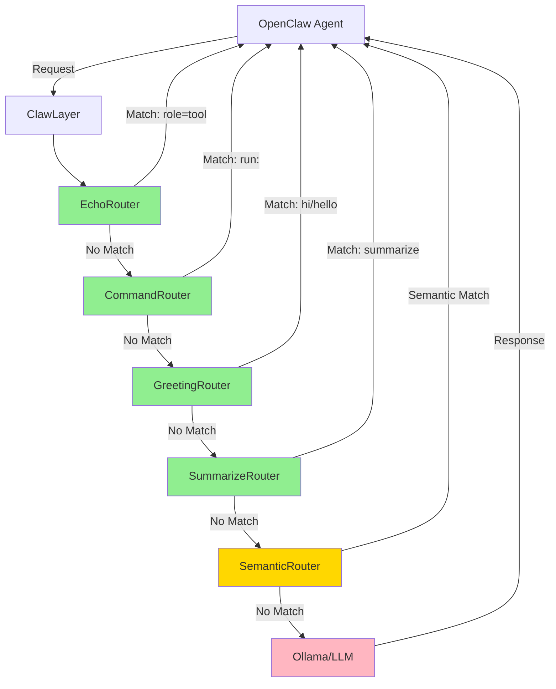
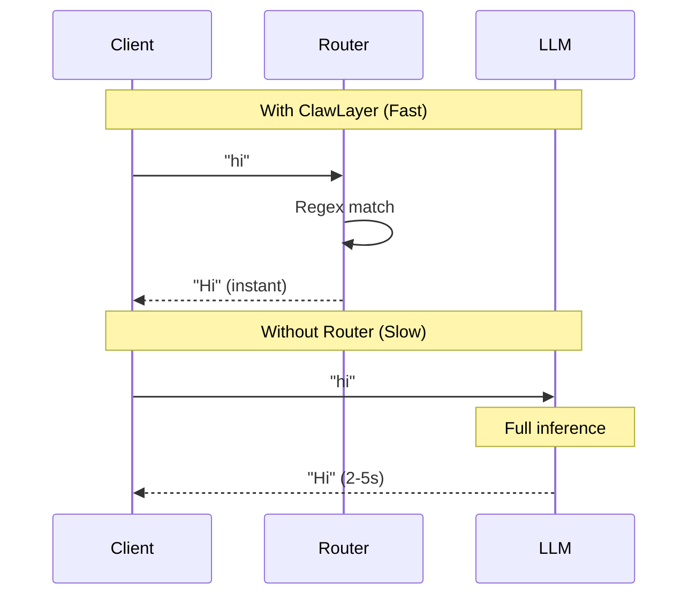

# ClawLayer

The intelligent layer for **OpenClaw** AI agents - optimizing performance through smart routing, caching, and cost management.

## Purpose

ClawLayer sits between OpenClaw agents and LLMs, providing an intelligent routing layer that intercepts common patterns before they reach expensive inference:

- **Instant responses** for greetings and routine queries
- **Zero-latency tool calls** for command execution patterns
- **Echo optimization** for tool results that don't need LLM processing
- **Transparent fallback** to full LLM inference when needed

By routing predictable interactions through static responses and intelligent caching, ClawLayer delivers instant responses for common operations while maintaining full LLM capabilities for complex reasoning tasks.

### System Architecture



**Legend**: 🟢 Fast (regex) | 🟡 Medium (semantic) | 🔴 Slow (LLM inference)

## Features

- **Regex-Based Routing**: Fast pattern matching for commands (run:)
- **Echo Optimization**: Bypasses LLM for tool execution results
- **Static Routes**: Instant responses for greetings and summaries
- **Semantic Routing**: Optional semantic similarity matching
- **LLM Fallback**: Forwards unmatched requests to Ollama
- **Streaming Support**: Full SSE streaming for both static and proxied responses
- **Testable**: 30 unit tests with 100% coverage of core logic

## Router Priority

Routers are executed in order until one matches:

1. **EchoRouter** - Detects tool execution results (role=tool, function=exec)
2. **CommandRouter** - Detects "run:" prefix for command execution
3. **GreetingRouter** - Matches greeting patterns (hi, hello, hey)
4. **SummarizeRouter** - Matches summary requests (summarize, checkpoint)
5. **SemanticRouterAdapter** - Optional semantic similarity matching
6. **Fallback** - Proxies to LLM for everything else

## Speed Optimization

### Greeting Route (Regex Matching)



### Command Execution (Regex Matching)


## Setup

```bash
# Install dependencies
pip install flask requests python-dotenv semantic-router

# Configure environment
cp .env.example .env
# Edit .env with your settings
```

## Configuration

`.env` file:
```
OLLAMA_URL=http://localhost:11434/v1/chat/completions
OLLAMA_MODEL=llama3.2
EMBED_MODEL=nomic-embed-text
PORT=11435
```

## Usage

```bash
# Run ClawLayer
python run.py -v

# Run with full request logging
python run.py -vv

# Run with streaming chunk logging
python run.py -vvvv

# Run tests
python -m unittest tests.test_clawlayer -v
```

## API

OpenAI-compatible endpoints:
- `GET /v1/models`
- `POST /v1/chat/completions`

Supports both streaming and non-streaming modes.

## Extending ClawLayer

Add a new router by implementing the Router interface:

```python
from clawlayer.router import Router, RouteResult

class CustomRouter(Router):
    def route(self, message: str, context: dict) -> Optional[RouteResult]:
        if "custom_pattern" in message:
            return RouteResult(name="custom", content="Custom response")
        return None
```

Then add it to the router chain in `app.py`:

```python
routers = [
    EchoRouter(),
    CommandRouter(),
    CustomRouter(),  # Add your router
    GreetingRouter(),
    SummarizeRouter()
]
```

### File Structure

```
clawlayer/
├── __init__.py          # Package exports
├── app.py               # Flask application & dependency injection
├── router.py            # Router implementations (greeting, command, echo, etc.)
├── handler.py           # Message handling & response generation
├── proxy.py             # LLM proxy for forwarding requests
└── config.py            # Configuration management

tests/
└── test_clawlayer.py    # Comprehensive unit tests (30 tests)
```

### Design Principles

- **Single Responsibility**: Each module has one clear purpose
- **Dependency Injection**: Components are loosely coupled and testable
- **Chain of Responsibility**: Routers are tried in priority order
- **Open/Closed**: Easy to add new routers without modifying existing code
- **Interface Segregation**: Abstract Router base class for all implementations
```

## Testing

All core components have comprehensive unit tests:

```bash
# Run all tests
python -m unittest tests.test_clawlayer -v

# Run specific test class
python -m unittest tests.test_clawlayer.TestCommandRouter -v

# Run specific test
python -m unittest tests.test_clawlayer.TestCommandRouter.test_detects_run_prefix -v
```

Test coverage:
- ✅ GreetingRouter (5 tests)
- ✅ EchoRouter (3 tests)
- ✅ CommandRouter (5 tests)
- ✅ SummarizeRouter (3 tests)
- ✅ RouterChain (3 tests)
- ✅ MessageHandler (3 tests)
- ✅ ResponseGenerator (3 tests)
- ✅ LLMProxy (2 tests)
- ✅ Config (2 tests)
- ✅ Integration (1 test)

**Total: 30 tests, all passing**

## Related Projects

- **[ClawRouter](https://github.com/BlockRunAI/ClawRouter)** - Advanced routing with load balancing, fallback chains, and cost optimization for production deployments
