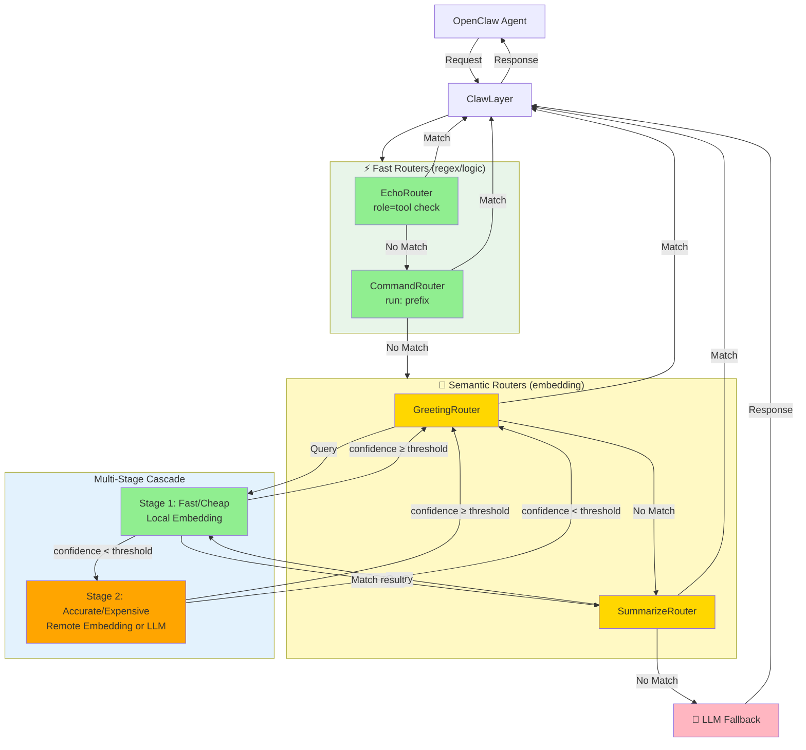
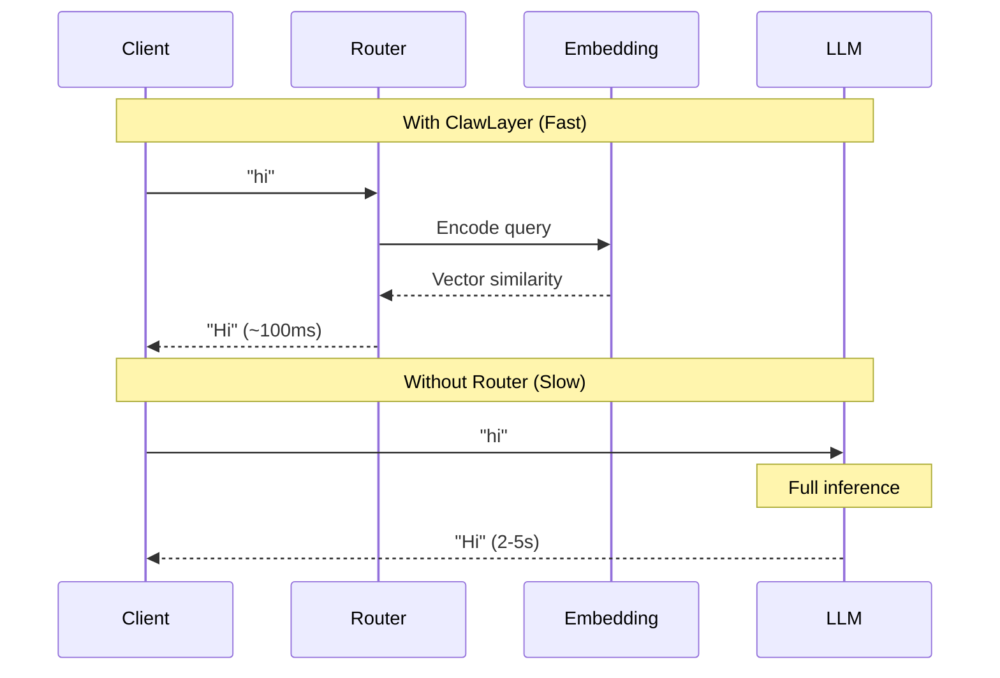
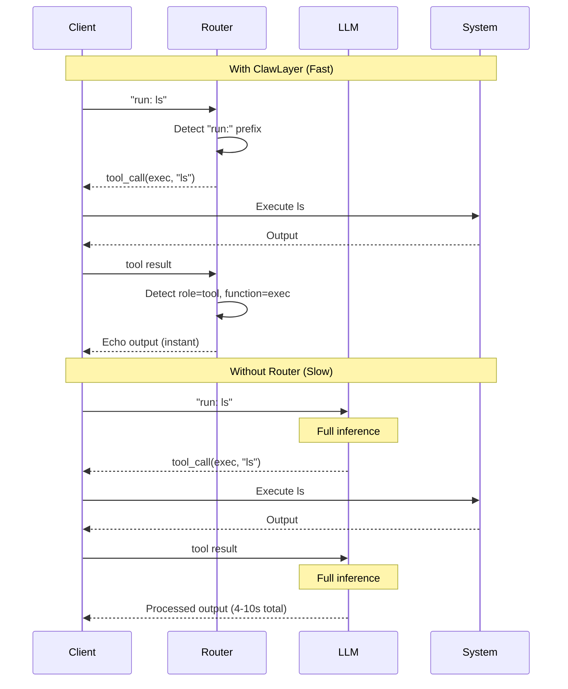
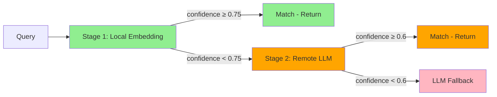

# ClawLayer Architecture

## System Architecture



**Legend**: 🟢 Fast/Cheap | 🟠 Accurate/Expensive | 🔴 Full LLM Inference

**Flow**: Fast Routers → Semantic Routers (with cascade) → LLM Fallback. Cascade tries cheap models first, escalates to expensive models only when needed.

## Router Priority

Routers are organized into two categories, each with its own priority:

### Fast Routers (checked first) - Quick Router
1. **EchoRouter** - Detects tool execution results (role=tool, function=exec) - 🟢 Instant
2. **CommandRouter** - Detects "run:" prefix for command execution - 🟢 Instant (regex)

These routers use pattern matching and logic checks for **zero-latency routing** - no embedding or LLM inference required.

### Semantic Routers (checked after fast routers)
3. **GreetingRouter** - Semantic similarity matching for greetings - 🟡 ~100ms (embedding)
4. **SummarizeRouter** - Semantic similarity for summary requests - 🟡 ~100ms (embedding)

### Fallback
5. **LLM Proxy** - Forwards to LLM for everything else - 🔴 2-5s (full inference)

## Speed Optimization

### Greeting Route (Semantic Matching)



### Command Execution (Regex Matching)



## Performance Comparison

| Scenario | Without ClawLayer | With ClawLayer | Improvement |
|----------|------------------|----------------|-------------|
| Simple greeting | 2-5s (LLM) | ~100ms (embedding) | 20-50x faster |
| Command execution | 4-10s (2x LLM) | <10ms (regex) | 400-1000x faster |
| Tool result echo | 2-5s (LLM) | <1ms (instant) | 2000-5000x faster |

## Cost Optimization

### Request Distribution

With proper configuration, ClawLayer routes:
- **75%** through Quick Router (zero cost)
- **20%** through Semantic Router (~$0.0001/request)
- **5%** through LLM Fallback (~$0.001/request)

### Cost Comparison

**Without ClawLayer** (1000 requests/day):
```
1000 requests × $0.001 = $1.00/day = $365/year
```

**With ClawLayer** (1000 requests/day):
```
750 quick router × $0 = $0
200 semantic × $0.0001 = $0.02
50 LLM × $0.001 = $0.05
Total = $0.07/day = $25.55/year
```

**Savings: 93%** ($339.45/year)

## Multi-Stage Cascade

Semantic routers support multi-stage cascading for optimal cost/accuracy tradeoff:



**Example flow:**
1. "hello" → Stage 1: 0.92 ≥ 0.75 ✓ → Return (fast/cheap)
2. "hey what's up" → Stage 1: 0.68 < 0.75 → Stage 2: 0.71 ≥ 0.6 ✓ → Return (accurate/expensive)
3. "weather today" → Stage 1: 0.3 < 0.75 → Stage 2: 0.4 < 0.6 → LLM fallback (full inference)

See [CASCADE.md](CASCADE.md) for advanced patterns.

## Component Overview

### Core Components

- **ClawLayer Proxy**: OpenAI-compatible API server
- **Router Factory**: Creates and manages router instances
- **Quick Routers**: Pattern-based instant routing
- **Semantic Routers**: Embedding-based similarity matching
- **Provider System**: Manages LLM/embedding providers
- **Web UI**: Real-time monitoring and configuration

### Data Flow

```
Request → ClawLayer → Quick Router → Semantic Router → LLM Fallback → Response
                           ↓              ↓                ↓
                        Instant        ~100ms           2-5s
                         $0          ~$0.0001         ~$0.001
```

## Observability

ClawLayer provides complete visibility into OpenClaw-LLM communication:

- **Request Inspection**: View full prompts, context, and parameters
- **Response Analysis**: Inspect complete responses (untruncated)
- **Router Tracking**: See which router handled each request
- **Performance Metrics**: Monitor latency, hit rates, and throughput
- **Cost Tracking**: Track API usage and costs per router

Use cases:
- 🛡️ **Security**: Monitor for prompt injection, data leakage
- 🐛 **Development**: Debug agent behavior, understand decisions
- 🔧 **Troubleshooting**: Identify bottlenecks, analyze failures
- 📚 **Learning**: Understand OpenClaw-LLM communication patterns

## Related Documentation

- [README.md](../README.md) - Main documentation
- [QUICK_ROUTER.md](QUICK_ROUTER.md) - Zero-latency routing
- [CASCADE.md](CASCADE.md) - Multi-stage routing patterns
- [TESTING.md](TESTING.md) - Testing guide
