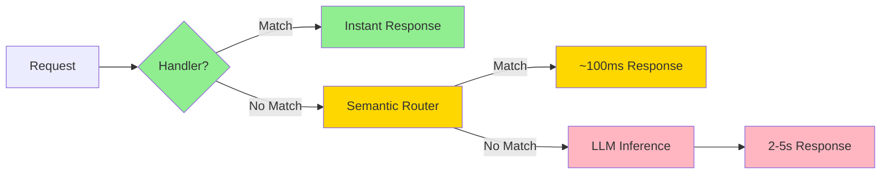

# Handlers

**Handlers** are ClawLayer's fast, pattern-based routing system that provides **zero-latency responses** without any embedding or LLM inference.

## Overview

Handlers use simple pattern matching (regex) and logic checks to instantly route requests, bypassing expensive model inference entirely. They are checked **first** in the routing pipeline before semantic routers.

## Performance

- **Latency**: <1ms (instant)
- **Cost**: $0 (no API calls)
- **Accuracy**: 100% for matching patterns

Compare this to:
- Semantic routing: ~100ms + API costs
- LLM inference: 2-5s + higher API costs

## Built-in Handlers

### 1. CommandHandler

**Purpose**: Detects command execution requests with "run:" prefix

**Pattern**: `^run:\s*(.+)$`

**Example**:
```
Input:  "run: ls -la"
Output: tool_call(function="exec", arguments={"command": "ls -la"})
Latency: <1ms
```

**Configuration**:
```yaml
routers:
  handlers:
    command:
      enabled: true
      prefix: "run:"  # Customizable prefix
      terminal: true  # Stop processing if matched (default)
```

**Terminal Flag**: Set `terminal: false` to allow the handler to match but continue processing through subsequent handlers. Default is `true` (stop on match).

**Use case**: OpenClaw agents can execute commands instantly without LLM inference:
```
User: "run: pwd"
→ Handler detects pattern
→ Returns tool call immediately
→ Agent executes command
→ Total time: <10ms (vs 2-5s with LLM)
```

### 2. EchoHandler

**Purpose**: Detects tool execution results and echoes them back

**Pattern**: Checks for `role=tool` and `function=exec` in message context

**Example**:
```
Input:  {role: "tool", function: "exec", content: "/home/user"}
Output: {role: "assistant", content: "/home/user"}
Latency: <1ms
```

**Configuration**:
```yaml
routers:
  handlers:
    echo:
      enabled: true
      terminal: true  # Stop processing if matched (default)
```

**Terminal Flag**: Set `terminal: false` to allow the handler to match but continue processing through subsequent handlers. Default is `true` (stop on match).

**Use case**: After command execution, echo results without LLM processing:
```
Agent executes: ls -la
→ Returns: [file listing]
→ EchoHandler detects tool result
→ Echoes output immediately
→ Total time: <1ms (vs 2-5s with LLM)
```

## Handler Pipeline



## Custom Handlers

You can add custom handlers for your specific patterns:

```python
from clawlayer.routers import Router, RouteResult
import re

class CustomQuickHandler(Router):
    def __init__(self):
        self.pattern = re.compile(r'^calc:\s*(.+)$')
    
    def route(self, message: str, context: dict):
        match = self.pattern.match(message)
        if match:
            expression = match.group(1)
            # Instant calculation without LLM
            try:
                result = eval(expression)  # Use safe eval in production
                return RouteResult(
                    name="calculator",
                    content=f"Result: {result}"
                )
            except:
                return None
        return None
```

Register in config:
```yaml
routers:
  handlers:
    priority:
      - calculator  # Your custom quick router
      - command
      - echo
    
    calculator:
      enabled: true
      terminal: true  # Stop on match (default)
```

## Terminal Flag Behavior

The `terminal` flag controls handler chain processing:

- **`terminal: true`** (default): Handler stops processing and returns response immediately
- **`terminal: false`**: Handler matches but allows subsequent handlers to process

**Example use case**: Logging handler that records requests but doesn't stop processing:

```yaml
routers:
  handlers:
    priority:
      - logger     # Logs but continues
      - command    # Processes command
    
    logger:
      enabled: true
      terminal: false  # Continue to next handler
    
    command:
      enabled: true
      terminal: true   # Stop on match
```

## Benefits

### 1. Cost Savings

**Without Handlers**:
```
100 command requests/day × $0.001/request = $0.10/day = $36.50/year
```

**With Handlers**:
```
100 command requests/day × $0/request = $0/day = $0/year
```

### 2. Speed Improvement

**Command execution flow comparison**:

| Step | Without Handlers | With Handlers |
|------|------------------|---------------|
| Parse request | 2-5s (LLM) | <1ms (regex) |
| Execute command | 10-100ms | 10-100ms |
| Process result | 2-5s (LLM) | <1ms (echo) |
| **Total** | **4-10s** | **10-100ms** |

**50-100x faster** for command execution!

### 3. Reliability

- No API rate limits
- No network latency
- No model availability issues
- 100% deterministic behavior

## Configuration Examples

### Handlers Only Mode

For maximum speed with zero API costs, use only handlers:

```yaml
# config.quickrouter.yml - Quick Router Only Configuration
providers:
  remote:
    url: http://localhost:11434/v1/chat/completions
    type: openai
    provider_type: llm
    models:
      text: llama3.2

defaults:
  text_provider: remote

server:
  port: 11435

routers:
  handlers:
    priority:
      - echo      # Echo tool results
      - command   # Detect "run:" commands
    
    echo:
      enabled: true
    
    command:
      enabled: true
      prefix: "run:"
  
  semantic:
    greeting:
      enabled: false  # Disable semantic routing
    summarize:
      enabled: false
```

See [config.quickrouter.yml](../config.quickrouter.yml) for the complete example.

### Example 1: Disable Handlers

```yaml
routers:
  handlers:
    command:
      enabled: false  # All commands go to LLM
    echo:
      enabled: false  # All tool results go to LLM
```

### Example 2: Custom Command Prefix

```yaml
routers:
  handlers:
    command:
      enabled: true
      prefix: "exec:"  # Use "exec: ls" instead of "run: ls"
```

### Example 3: Multiple Handlers

```yaml
routers:
  handlers:
    priority:
      - calculator    # Check calculator first
      - command       # Then commands
      - echo          # Then tool results
    
    calculator:
      enabled: true
      prefix: "calc:"
    
    command:
      enabled: true
      prefix: "run:"
    
    echo:
      enabled: true
```

## Monitoring

Handler hits are tracked in the web UI:

- **Dashboard**: Shows handler hit rate vs semantic/LLM
- **Logs**: Each request shows which router handled it
- **Metrics**: Average latency for handler requests

Example dashboard:
```
Handlers:        75% (750/1000 requests, avg 0.5ms)
Semantic Router: 20% (200/1000 requests, avg 120ms)
LLM Fallback:     5% (50/1000 requests, avg 3.2s)
```

## Best Practices

1. **Use handlers for deterministic patterns**: Commands, calculations, lookups
2. **Keep patterns simple**: Complex regex can slow down routing
3. **Validate input**: Handlers bypass LLM safety checks
4. **Monitor hit rates**: Optimize patterns to maximize handler usage
5. **Test thoroughly**: Handlers are deterministic - test all edge cases

## Related Documentation

- [README.md](../README.md) - Main documentation
- [CASCADE.md](CASCADE.md) - Multi-stage semantic routing
- [TESTING.md](TESTING.md) - Testing handlers
